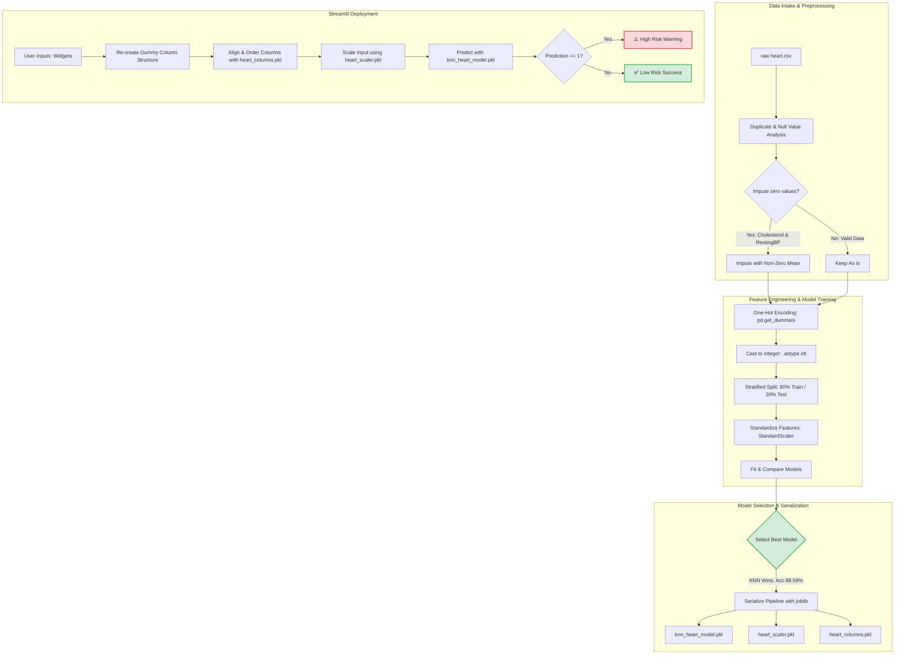

# ❤️ Heart Disease Prediction System

[](https://www.python.org/)
[](https://streamlit.io/)
[](https://scikit-learn.org/)
[](https://pandas.pydata.org/)
[](https://opensource.org/licenses/MIT)

An end-to-end Machine Learning web application that predicts the risk of cardiovascular disease using patient clinical data. The core model is built on a **K-Nearest Neighbors (KNN)** classifier, achieving **88.59% accuracy** and an **89.86% F1-score**. The model is deployed as a user-friendly, responsive Streamlit dashboard.

---

## 🗺️ End-to-End Pipeline & Workflow

The diagram below details the entire data engineering, training, and deployment pipeline for this project:



---

## 🧠 Core Engineering & Modeling Decisions

To build a highly accurate and clinically reliable system, several key data science decisions were made:

### 1. Zero Value Imputation (Data Quality)
During Exploratory Data Analysis (EDA), anomalous zero values were detected in critical columns:
* **Cholesterol**: 172 records contained `0` mg/dL (biologically impossible for living patients).
* **RestingBP**: 1 record contained `0` mm Hg.
* **Decision**: Rather than dropping these records (which would reduce the dataset size by ~19%), these zeroes were imputed with the **mean values calculated exclusively from non-zero records** for each respective feature.
  * *Cholesterol Mean Imputed*: `~244.64 mg/dL`
  * *RestingBP Mean Imputed*: `~132.54 mm Hg`

### 2. Categorical Encoding & Dimensionality
The dataset contains several categorical columns (`Sex`, `ChestPainType`, `RestingECG`, `ExerciseAngina`, `ST_Slope`).
* **Decision**: We applied One-Hot Encoding via `pd.get_dummies(df, drop_first=True)` to convert categorical strings into numeric indicator variables while omitting the first category. This prevents multicollinearity (the dummy variable trap).
* The resulting Boolean variables were cast to integers (`.astype(int)`) to ensure strict compatibility with scikit-learn models.

### 3. Feature Scaling for Distance Metrics
* **Decision**: We applied a `StandardScaler` to normalize the feature space.
* **Why it matters**: Algorithms like K-Nearest Neighbors (KNN) rely heavily on Euclidean distance metrics. If features are not scaled, high-magnitude features (e.g., `Cholesterol` range 100-600) would dominate distance calculations over lower-range features (e.g., `Oldpeak` range 0.0-6.0), rendering the model ineffective.

### 4. Stratified Train-Test Split
* **Decision**: An 80/20 train-test split was executed using a stratified split strategy (`stratify=y`).
* **Why it matters**: Stratification ensures that the distribution of target outcomes (`HeartDisease` vs `No HeartDisease`) in both the training set and the validation/test set remains identical, preventing bias and ensuring robust validation.

---

## 📊 Model Evaluation & Selection Matrix

We evaluated five distinct classifiers on the 20% validation set. The results are summarized below:

| Machine Learning Model | Accuracy 🎯 | F1 Score 📈 | Performance Status |
| :--- | :---: | :---: | :---: |
| **K-Nearest Neighbors (KNN)** | **88.59%** | **0.8986** | **🏆 Best Performer (Selected)** |
| **Logistic Regression** | 87.50% | 0.8878 | Highly Stable / Linear Baseline |
| **Naive Bayes (Gaussian)** | 86.96% | 0.8788 | Strong Probabilistic Baseline |
| **SVM (RBF Kernel)** | 86.41% | 0.8804 | Strong Non-linear Performer |
| **Decision Tree** | 74.46% | 0.7513 | Overfitting / Prone to High Variance |

### Why KNN Was Selected
1. **Superior Accuracy & F1 Score**: Outperformed all models, demonstrating a strong ability to classify patient clusters.
2. **Distance-Based Fit**: The normalized clinical metrics group patients into highly cohesive risk clusters, making distance-based classification optimal once normalized using standard scaling.

---

## 🖥️ Streamlit Production Deployment (`app.py`)

The serialized training artifacts (`knn_heart_model.pkl`, `heart_scaler.pkl`, and `heart_columns.pkl`) are utilized in a real-time web interface.

### Handling Dynamic User Inputs
A key engineering challenge was translating 11 user inputs from Streamlit widgets into the exact **15-feature shape** expected by the model. The web application resolves this through a multi-step pre-prediction pipeline:
1. **Raw Mapping**: Collects inputs (e.g., `Sex = 'M'`, `ChestPainType = 'ATA'`) and builds a raw dictionary.
2. **One-Hot Replication**: Dynamically flags dummy columns (e.g., setting `'Sex_M': 1`, `'ChestPainType_ATA': 1`).
3. **Missing Column Recovery**: Loops over the loaded column list (`heart_columns.pkl`) and appends any missing features (e.g., `'Sex_F'`, `'ChestPainType_ASY'`) with a default value of `0`.
4. **Strict Ordering**: Reorders columns to match the model training matrix exactly.
5. **Real-time Standard Scaling**: Feeds the ordered inputs into the loaded `StandardScaler` prior to triggering predictions.

---

## 📁 Repository Directory Structure

```text
Heart-Disease-Prediction/
│
├── .git/                      # Version control database
├── HeartdiseaseFinal.ipynb    # Jupyter Notebook containing full EDA, data cleaning, and training
├── app.py                     # Streamlit web application dashboard
│
├── knn_heart_model.pkl        # Serialized K-Nearest Neighbors Classifier model
├── heart_scaler.pkl           # Serialized StandardScaler instance
├── heart_columns.pkl          # Serialized list of expected features
│
├── requirements.txt           # Project environment dependencies
└── README.md                  # Comprehensive project documentation
```

---

## 🚀 Setup & Execution Guide

Follow these steps to run the application locally on your machine:

### 1. Clone the Repository
```bash
git clone https://github.com/DakshDaga/Heart-Disease-Prediction.git
cd Heart-Disease-Prediction
```

### 2. Set Up a Virtual Environment (Recommended)
```bash
# Windows
python -m venv venv
venv\Scripts\activate

# macOS / Linux
python3 -m venv venv
source venv/bin/activate
```

### 3. Install Dependencies
```bash
pip install -r requirements.txt
```

### 4. Run the Streamlit Dashboard
```bash
streamlit run app.py
```
This will launch the application server and open it automatically in your default web browser (typically at `http://localhost:8501`).

---

## 🛠️ Built With

* [Python](https://www.python.org/) - Programming language
* [Streamlit](https://streamlit.io/) - Web UI framework
* [Scikit-Learn](https://scikit-learn.org/) - Machine learning algorithms
* [Pandas](https://pandas.pydata.org/) - Data manipulation and processing
* [Seaborn](https://seaborn.pydata.org/) - Exploratory data visualization
* [Joblib](https://joblib.readthedocs.io/) - Model serialization

---
*Created with ❤️ by Daksh Daga.*
